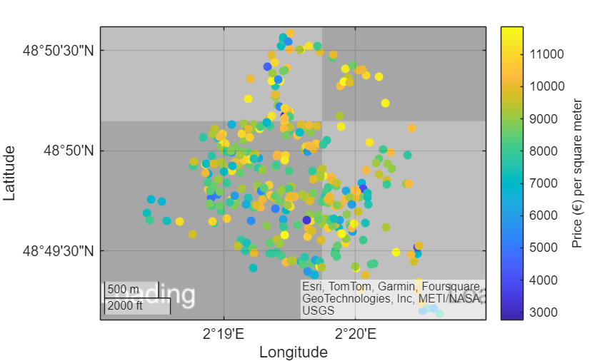

# immo

[](https://matlab.mathworks.com/open/github/v1?repo=yanndebray/immo&file=immo.mlx)

🏠 Real Estate prices in French cities

Focused view: 
- [https://matlab.mathworks.com/open/github/v1?repo=yanndebray/immo&file=immo.mlx&focus=true](Live script)
- [https://matlab.mathworks.com/open/github/v1?repo=yanndebray/immo&file=immo.mlapp&focus=true](App)

Inspiration: [https://github.com/slevin48/immo](https://github.com/slevin48/immo)


Data source: [https://www.data.gouv.fr/fr/datasets/5cc1b94a634f4165e96436c1/](https://www.data.gouv.fr/fr/datasets/5cc1b94a634f4165e96436c1/) 


Example in Paris (14th arrondissement)

```matlab
commune = "75114";
price_min = 2500;
price_max = 12500;
date_start = datetime("2024-03-14", "InputFormat", "uuuu-MM-dd");
 
T = load_data(commune);
T = T(T.prixm2 > price_min & T.prixm2 < price_max & T.date_mutation > date_start,{'id_mutation','date_mutation','valeur_fonciere','prixm2','adresse_numero','adresse_nom_voie','latitude','longitude','marker_color'})
```
| |id_mutation|date_mutation|valeur_fonciere|prixm2|adresse_numero|adresse_nom_voie|latitude|longitude|marker_color|
|:--:|:--:|:--:|:--:|:--:|:--:|:--:|:--:|:--:|:--:|
|1|'2024-555170'|28-Jun-2024|264000|8516|49|'AV JEAN MOULIN'|48.8248|2.3205|'yellow'|
|2|'2024-555253'|28-Jun-2024|187000|8130|14|'RUE PIERRE LAROUSSE'|48.8288|2.3152|'yellow'|
|3|'2024-555329'|28-Jun-2024|510670|9821|1|'RUE THIBAUD'|48.8296|2.3277|'yellow'|
|4|'2024-555501'|28-Jun-2024|355000|9342|11|'RUE FRANCIS DE PRESSENSE'|48.8339|2.3169|'yellow'|
|5|'2024-555551'|28-Jun-2024|258160|7171|21|'RUE DU DEPART'|48.8421|2.3239|'yellow'|
|6|'2024-555586'|28-Jun-2024|501600|8957|65|'RUE RAYMOND LOSSERAND'|48.8342|2.3191|'yellow'|
|7|'2024-555621'|28-Jun-2024|485000|10104|33|'AV DE LA SIBELLE'|48.8249|2.3384|'red'|
|8|'2024-555717'|28-Jun-2024|1225000|10381|53|'RUE DE L ABBE CARTON'|48.8292|2.3181|'red'|
|9|'2024-555832'|28-Jun-2024|356450|8101|40|'RUE DES ARTISTES'|48.8259|2.3343|'yellow'|
|10|'2024-555844'|28-Jun-2024|615000|9179|199|'AV DU MAINE'|48.8295|2.3267|'yellow'|
|11|'2024-555892'|28-Jun-2024|395000|9634|18|'RUE DU MOULIN VERT'|48.8300|2.3239|'yellow'|
|12|'2024-555896'|28-Jun-2024|209000|10450|17|'RUE DES THERMOPYLES'|48.8325|2.3189|'red'|
|13|'2024-555926'|28-Jun-2024|432000|10537|95|'AV DU MAINE'|48.8371|2.3235|'red'|
|14|'2024-556023'|28-Jun-2024|1270000|11651|14|'RUE CASSINI'|48.8373|2.3371|'red'|

```matlab
s = geoscatter(T,"latitude","longitude","filled");
s.ColorVariable = "prixm2";
c = colorbar;
c.Label.String = "Price (€) per square meter";
```



```matlab
histogram(T.prixm2)
title("Price (€) per square meter m²")
```


